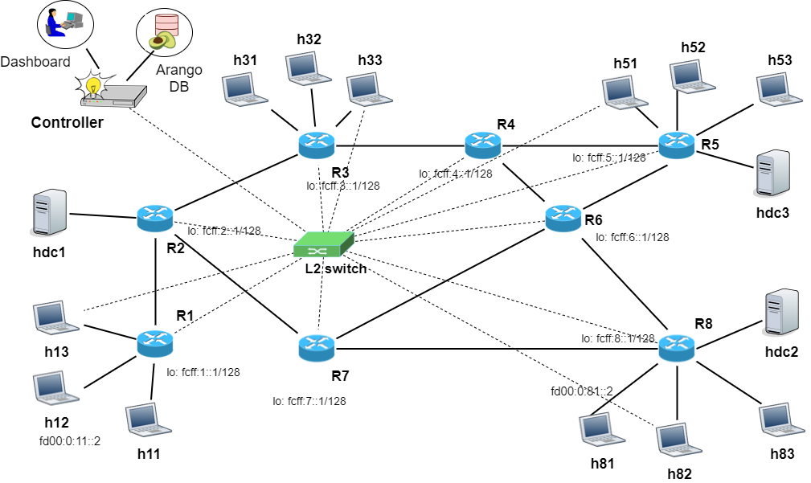

# 8r-1c-srv6-pm Topology

A Mininet topology with 8 routers running IS-IS routing protocol, 12 hosts, 3 datacenters and a controller connected out-band to all the routers and hosts of the network.

This topology is the same as 8r-1c-out-band, but same nodes are configured to run Performance Measurement experiments.

## Topology overview



## Start the topology

To start the topology:
```
python3 isis8d.py
```

## Experiment description

```text
The goal of the experiment is to measure TWAMP delay between sender and reflector by using SRv6 indication for routing. 
Example of usage: we want to use r1 as sender node and r8 as reflector node, we want to use the segment list <r3,r6>. It's possible to use any node as sender and reflector simply by starting the relavite scripts in the target nodes. For the set up of segment list is necessary to write the addresses of segments in the file 'SRv6-List', one per line. So in order to start this experiment:
-add the addresses of r3 and r6 in RSv6-List,
-wait 10s before to run the scripts in terminals to permit the correctly set up of network,
-in r8 type: ./reflector,
-in r1 type: ./sender

It's also possible to modify the number packet sent through the varible MAXPACKETSENT in twamp_dM.py.

The packet built with scapy have the follow schema in order to introduce the SRv6 header: IPv6\SRv6Header\IPv6_inner\UDP

```
## Scapy problem

If you use the scapy version 2.4.5 you will notice some errors relative to interfaces list passed to sniff function, to solve the problem simply downgrade scapy to 2.4.4